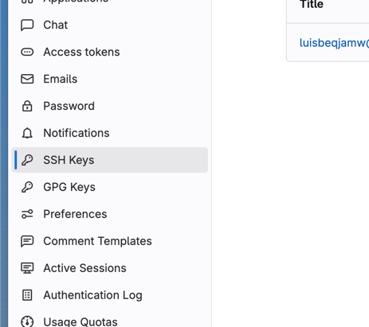
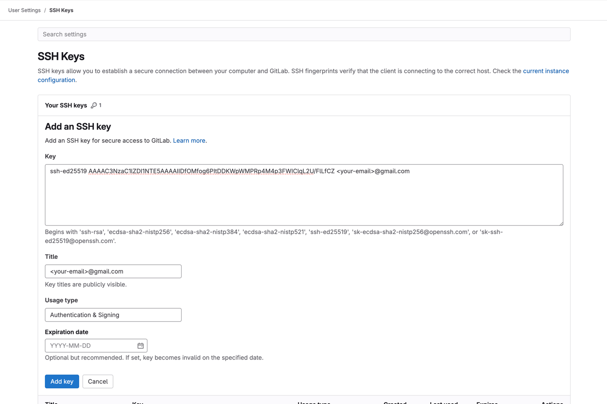

# How to Create an SSH Key and Connect It with Your GitLab Account

This guide walks you through the steps to set up an SSH key on your computer and connect it to your GitLab account.

---

## Generating a New SSH Key

To generate a new SSH key on your local machine, use the following command. Replace `your_email@example.com` with your email address.

```bash
ssh-keygen -t ed25519 -C "your_email@example.com"
```

### Steps to Follow
1. When prompted, press **Enter** to accept the default file location:
   ```
   > Enter a file in which to save the key (/Users/YOU/.ssh/id_ALGORITHM): [Press enter]
   ```
2. Leave the passphrase empty by pressing **Enter**:
   ```
   > Enter passphrase (empty for no passphrase): [Press enter]
   > Enter same passphrase again: [Press enter]
   ```

Your SSH key is now generated and saved on your local machine.

---

## Connecting the SSH Key to GitLab

1. Open your GitLab settings by navigating to **Preferences**.

   

2. Go to the **SSH Keys** page.

   

3. Locate your SSH key file on your system:
    - **Mac users**: `/Users/<YourUsername>/.ssh/`
    - **Windows users**: `C:\Users\<YourUsername>\.ssh\`

   In this directory, find the file named `id_ed25519.pub`.

4. Open the file `id_ed25519.pub` using a text editor to view its contents.

5. Copy the content of the file and paste it into the **Key** field on GitLab's SSH Keys page.

   You should see a page similar to this:

   

6. Click **Add Key** to complete the setup.

---

Your SSH key is now connected to your GitLab account, enabling secure authentication for Git operations.